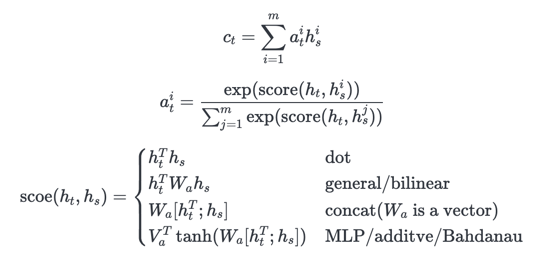

# Sequence to Sequence Learning with Attention Mechanism
this repo is the implementation of [Luong Attention](https://arxiv.org/abs/1508.04025) and [Bahdanau Attention](https://arxiv.org/abs/1409.0473)
- We conducted English-to-German translation experiments using English and German bilingual references from the [Multi30k](http://www.statmt.org/wmt16/multimodal-task.html#task1) dataset.
- The formula for the attentional mechanism is as follows(sorry for without notion):

## See our procedure in Notebook
see [experiment.ipynb](./experiment.ipynb)

## Results:
- Luong Attention
  - We find that dot and general method few attend to things make sense such as word alignment.
  - In fact, it turns out that the dot and general method is unstable(compare to MLP). In experiments, things that each model attend to is very different and most of steps of models do not attend to things make sense.
  - The attention weight is very sharp, especially in the general method , just like extracting a particular 'memory unit'.

- Bahdanau Attention 
  - we found Bahdanau attention converges more quickly than Luong attention and overfitting problem is more severe.
  - Bahdanau's proposed additive score function performs better and is more stable(always almost alignment) than other functions.

see [Luong_experiment.ipynb](./Luong_experiment.ipynb) and [Bahdanau_experiment.ipynb](./Bahdanau_experiment.ipynb) for details.
## To do:
- [x] Bahdanau Attention
- [ ] Ensemble Learning
- [x] visualize attention weight
- [ ] my own batching operation
  - unfinished in old_dataset.py

## Reference
[pytorch-seq2seq](https://github.com/sicnu-long/pytorch-seq2seq) @bentrevett

[SFU CMPT413/825 HW4](https://github.com/jeticg/Projekt015-CMPT413-HW4) @jeticg